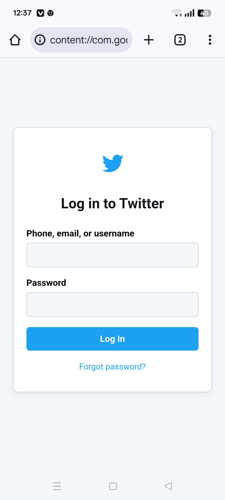

<!-- Header Section -->

<h1 style="color: #3b82f6;">✨ Project 6— Beautiful Website ✨</h1>

---

## 🔥 Project Overview

🎯 **Twitter Page Project ** is part of our _"Coders and Programmers"_ learning community.  
📘 It’s crafted with love to help beginners learn **HTML, CSS**, and creative project deployment.

> 🧩 **Goal:** Real-world learning through actual project development  
> 🤝 **Built by:** Our passionate coding community members

---

## 🌐 Live Demo

🎉 **Experience the Project Live Here:**  
🔗 [🌍 Visit the Live Website →](nbasicproject6.nettlify.app)

---

## 📸 Project Preview

> Below is a preview of the working app/website

  

---

## 🛠️ Tech Stack Used

| Technology | Description                |
|------------|----------------------------|
| 🧱 HTML     | Structure of the Website   |
| 🎨 CSS      | Styling and Responsive UI |

---

## 📁 Features

✅ Fully Responsive Design  
✅ Beautiful UI with Color Theme  
✅ Clean Code & Easy to Understand  
✅ Beginner-Friendly with Room to Improve

---
---

## 🎓 From Our Community

✨ This project was developed by learners of the  
**🎓 Coders and Programmers Learning Community** 🚀

> Let’s build, grow, and rise together as developers 💪

Want to join us?  
🔗 [Join the Community →](https://m.me/cm/Aban-wKeswCNotpD/?send_source=cm%3Acopy_invite_link)

---

  

<h3 align="center" style="color: #6366f1;">“Learn. Build. Share. Repeat.” 💡</h3>

---
